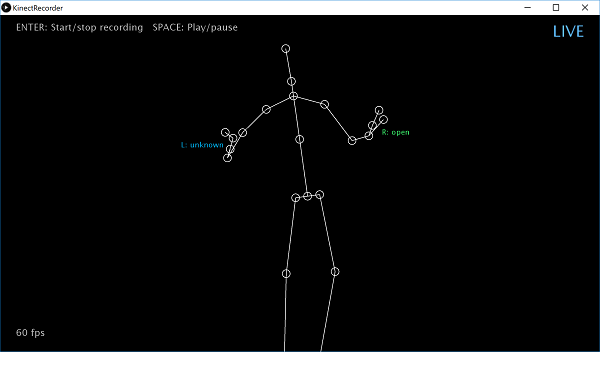
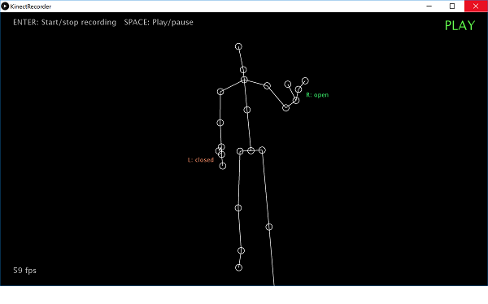

# Kinect2Processing

Sketches for **Processing 3** with **Kinect v2**. They require the [KinectPV2](http://codigogenerativo.com/kinectpv2/) library by Thomas Lengeling.

I developed these sketches for my course [Interaction Engineering](http://interaction.hs-augsburg.de) at Augsburg University of Applied Sciences, as explained in my [Kinect chapter](http://michaelkipp.de/interaction/kinect.html) (German) of my course notes.

## KinectRecorder

This sketch allows you to record a piece of motion by hitting the ENTER key (once for starting, once more for stopping). You can playback your recording with the SPACE key. There can only be one motion sequence stored at any time.

*(c) 2018 [Michael Kipp](http://michaelkipp.de)*
